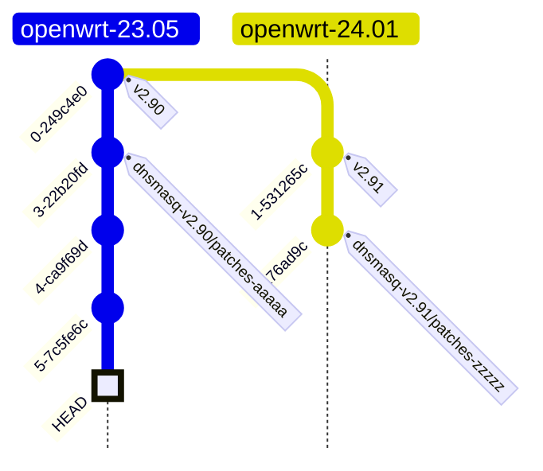

# SL Dnsmasq fork
Our fork of dnsmasq with openwrt patches, regex patches, and address mapping capabilities.

Regex and OpenWRT patches come from [lixingcong/dnsmasq-regex-openwrt](https://github.com/lixingcong/dnsmasq-regex-openwrt)

## Development
### Updating dnsmasq, OpenWRT version, and/or patches
#### Fetching upstream
The `fetch-upstream.sh` script clones dnsmasq, applies patches from [lixingcong/dnsmasq-regex-openwrt](https://github.com/lixingcong/dnsmasq-regex-openwrt), and tags the resulting commit.

Usage: `fetch-upstream.sh <dnsmasq_tag> <regex_patch_branch>`.

`regex_patch_branch` should be the OpenWRT version you are using, and should match a branch from https://github.com/lixingcong/dnsmasq-regex-openwrt

`dnsmasq_tag` should be the corresponding dnsmasq version (check the Makefile in that branch for `PKG_UPSTREAM_VERSION`)

The script will print a tag name that you can branch off of.

Example usage:
```
$ fetch-upstream.sh v2.90 openwrt-23.05
...
Done. You can branch off the tag dnsmasq-v2.90/patches-37e255c40ee1c03e79624b297442bde7ebe96f65.
...
```

#### Working off upstream
Now that you have a tagged commit, you must merge our changes onto this branch. This can be messy.
You must not include any code from the previous patch commit when merging.



In this case, you want to move the commits from HEAD up to but not including `dnsmasq-v2.90/patches-aaaaa` onto `openwrt-24.01`.

After you finish, remember to push the tag! It's a useful reference.


## Resulting artifact
To deploy this onto a router, we must create a `.patch` file. You can do this by running `git diff <tag> > <patch_file>`.

Example:
`git checkout openwrt-23.05 && git diff dnsmasq-v2.90/patches-37e255c40ee1c03e79624b297442bde7ebe96f65 > address-map.patch`
